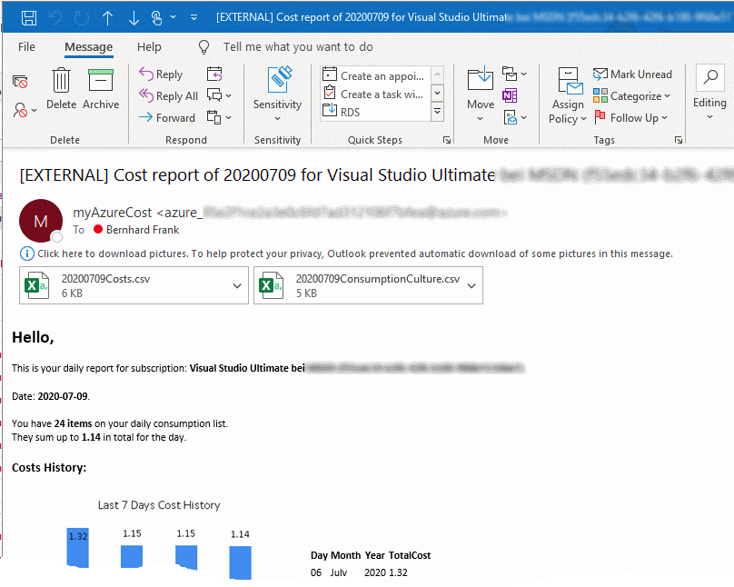

# myAzureCost...
  
_...**sends** you a **daily email** with your **azure consumption report**..._  
_...**calculates costs** if **you uploaded a price sheet**..._  
_...uses ARM template for setup, azure automation for daily tasks, sendgrid as 0 cost email solution and storage account to hold data._  
_...**you build** (guided) this in **your subscription**._  

# Result & Screenshots  
In your inbox you'll get a report each day of the usage and the costs (if you upload a price sheet):  
|  | your **daily cost email** looks similar to this|
|--|--|
|  | **consumption report is attached to email** |
|  | some excel cosmetics on the **cost report** |  
  
## The email contains some charts:
|   |   |  | |
|--|--|--|--|
| **cost email contains history graph**. Azure table is used to hold the data. | Display the **costs per region**. | **Cost per Resource Group** | Cost Per Category |

# The Setup  
[1. Deploy the ARM Template](./SetupChallenges/DeployTheARMTemplate/README.md)  
[2. Create an Azure Run As Account](./SetupChallenges/CreateAzureRunAsAccount/README.md)  
[3. Create a Table and see AA Variables Section](./SetupChallenges/CreateTableAndVariables/README.md)  
[4. Generate a price sheet](./SetupChallenges/GenerateAPriceSheet/README.md)  
[5. Run a report](./SetupChallenges/RunAReport/README.md) 

# The Solution Description & Architecture  
The idea of this project was to **gather daily all relevant azure usage information as CSV** **for a reliable cost** estimation | **calculation**.
When you try, demo, PoC a scenario the usage / cost can be gathered with myAzureCost.  
You **don't** have to **wait for the end of the month**. You may then do some 'excel magic' whith the obtained reports and have a solid cost estimation for your manager, customer,...  
BTW you **learn how azure services used work by investigating**:
- which resources are consumed
- in which quantities. (hours, network bandwidth, read / write operations,...)

**you'll know what is driving costs** up and what can be neglected. This should help **to optimize** and save **costs**.  
**Cost can be calculated if you provide a price sheet**. An example of how to generate a price sheet and what the format should look like is provided [in the setup
](./SetupChallenges/GenerateAPriceSheet/README.md).  
**Azure gathers usage info of the all resources used** (including ones that have 0 cost) **but does not immediately provide them**. **It'll take time** (hours, a day) **until you can query them** using PowerShell | REST. 
Therefore **myAzureCost looks back** and tries to summarize the **usage of the previous day**.  
It'll use **azure automation to gather data** save it in a **storage account (daily aggregations** + price sheet) and save **history cost information in an azure table**. It's **deployed** using an **ARM template** you can find in the SetupArtefacts folder. You don't need to setup anything on your box - as we **use the Azure Cloud Shell** to kick of the deployment scripts. **Emails** are sent **using the free plan from sendgrid** (a 3rd party service).  
The **final architecture** looks like this:

# What can go wrong
**no usage report** - check if there is a report for the day (i.e. the previous day) on the storage account if not run the RunBk_UsageAggregates watch for errors. e.g. do you have an AA Run as account?

**empty usage report** - If you run the RunBk_UsageAggregates too early in the morning the report may be empty as Azure hasn't provided the usage yet. Try at a later time.

**empty cost reports** - Do you have a price sheet uploaded? Can you download the pricesheet with the URI (SAS token) you have generated? Is it a CSV (';' separated) in en-us (no commas but dot as decimal specifier). Does it have a _MeterId_ and _MeterRates_ column?

**my report is not 100% accurate** - Yes it is an estimation - why? because some services include free quantity which is not subtracted from the costs being calculated here.

**no email** - Did your sendgrid setup work? Or your sendgrid password was too easy or did it expire?  Azure Portal -> rg-myAzureCost ->sgridazconsumption... -> Manage