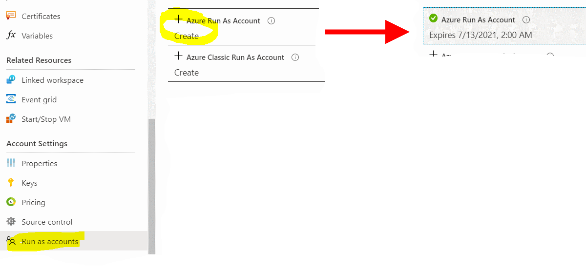
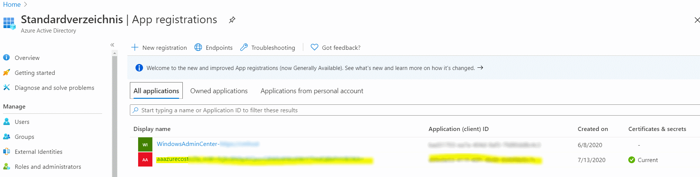
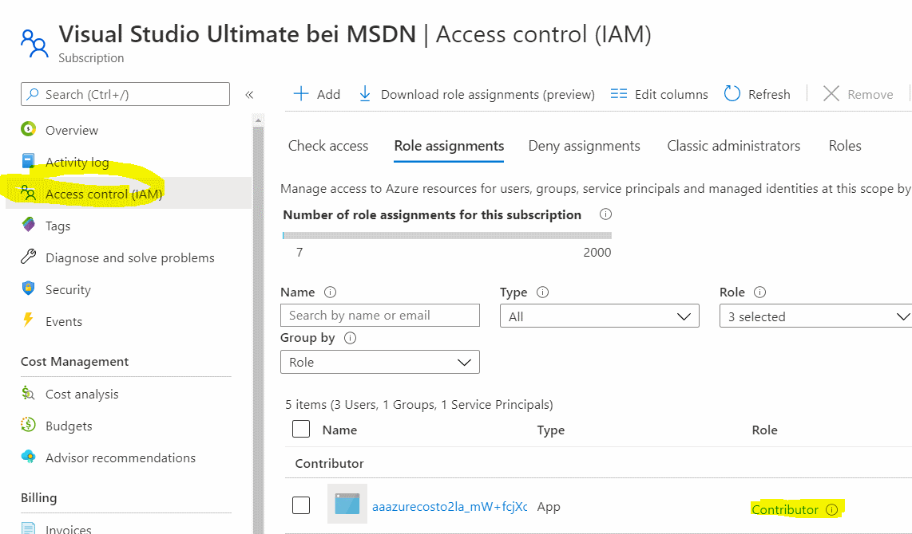

# 2. Create an Azure Run As Account

[back](../../README.md)

For Azure Automation (AA) to perform tasks in the current subscription (e.g. gather usage information) needs an account a so called Run As Account. This account is a so called service principal (SP) which has permissions in the current subscription. To create this SP and connect it to AA please do the following:  


## 1. Create an Azure Automation RunAs Account
```
[Azure Portal] -> Resource Groups -> "rg-AzureCost" -> 'aaazurecost...' (Your Automation Account) -> Account Settings -> Run as accounts
```  
Hit **Create**, **wait** and **watch** the account being created:  
  
Note that **this account has an _'expiration date'_**.  
  
## 2. [Optional] - See how the AA Run As account manifests itself throughout AAD and your subscription
|  |  |
|--|--|
| `[Azure Portal] -> Azure Active Directory -> App registrations` |  `[Azure Portal] -> Subscriptions -> Access Control (IAM) -> View role assignments -> 'View'` |


[next](../CreateTableAndVariables/README.md)
