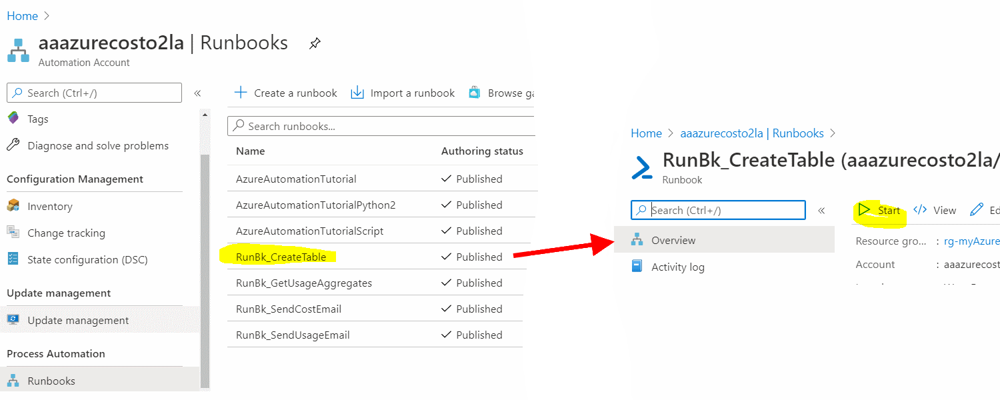
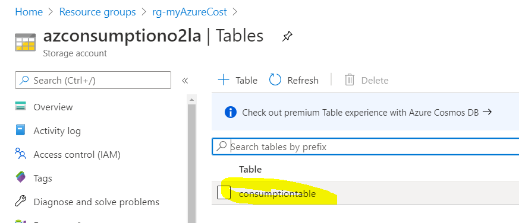

# 3. Create a table and inspect variables section

[back](../../README.md)

Storing settings for Azure Automation (AA) e.g. account information, locale settings,... AA credentials and AA variables can be used.
In our myAzureCost sample we use:  
- **AA Credentials** to store the **sendgrid's account** settings:  
- **AA Variables** to hold **settings** **needed** for the AA **Runbooks** that do the usage & cost calculation
- **one Azure table** to **store** processed data e.g. **daily cost history**.

## 1. Inspect the variables
```
[Azure Portal] -> Resource Groups -> "rg-AzureCost" -> 'aaazurecost...' (Your Automation Account) -> Variables
```

| Variable **Name** | **Description** |
|---|---|
| myAzureCostAzureSubscriptionId | _**GUID of your subscription** to calculate the usage for_ |
| myAzureCostCultureInfo | _e.g. **de-DE** for reports (CSVs) to come with numbers, date formatted for Germans_  |
| myAzureCostPriceSheetURI | _a URI pointing to a CSV with pricing information about azure resources - we'll take care of this soon_ |
| myAzureCostSAContainer | _where your daily reports are stored - pls don't change_|
| myAzureCostSATable | _table name to hold your daily usage costs for 'history view'_ |
| myAzureCostSmtpRecipient | _email recipient of the report_  |
| myAzureCostStorageAccountName | _where your daily reports are stored_ |


## 2. Create the azure table to hold your daily usage costs for 'history view'
There is a **AA Runbook that will create an azure table for us - we only need to start it**:  
```
[Azure Portal] -> Resource Groups -> "rg-AzureCost" -> 'aaazurecost...' (Your Automation Account) -> "Process Automation" Runbooks -> RunBk_CreateTable -> Start
```  
  

This runbook will execute PowerShell code that creates an Azure table using the AA Runas Account. Once finished you should have a table in:  
```
[Azure Portal] -> Resource Groups -> "rg-AzureCost" -> 'azconsumption...' (Your Storage Account) -> Tables
```  
  

[next](../GenerateAPriceSheet/README.md)
