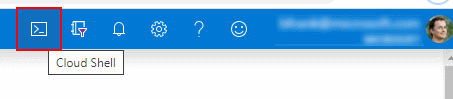
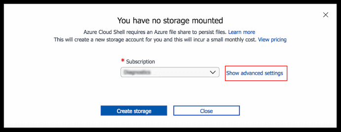
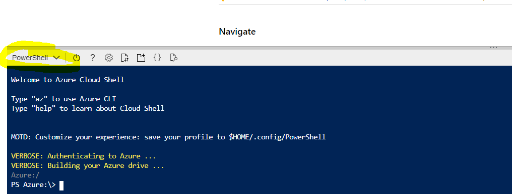
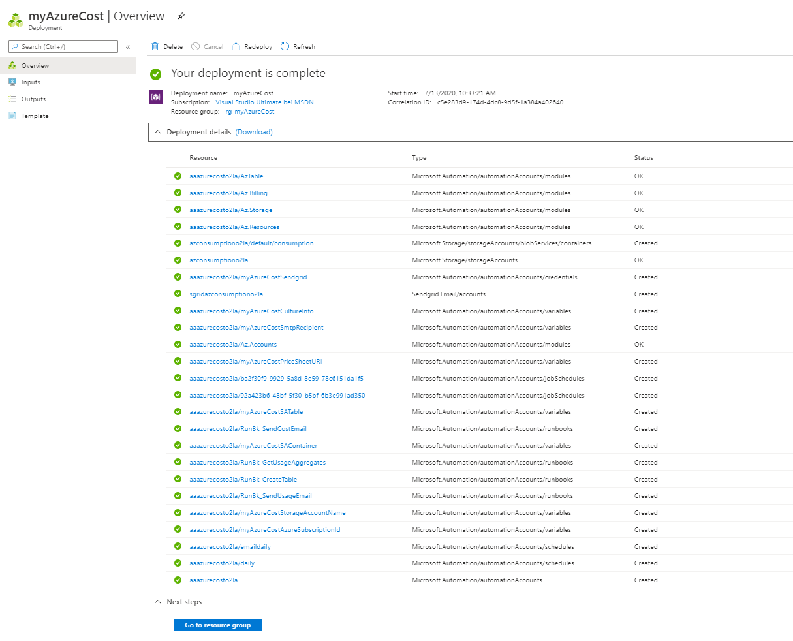
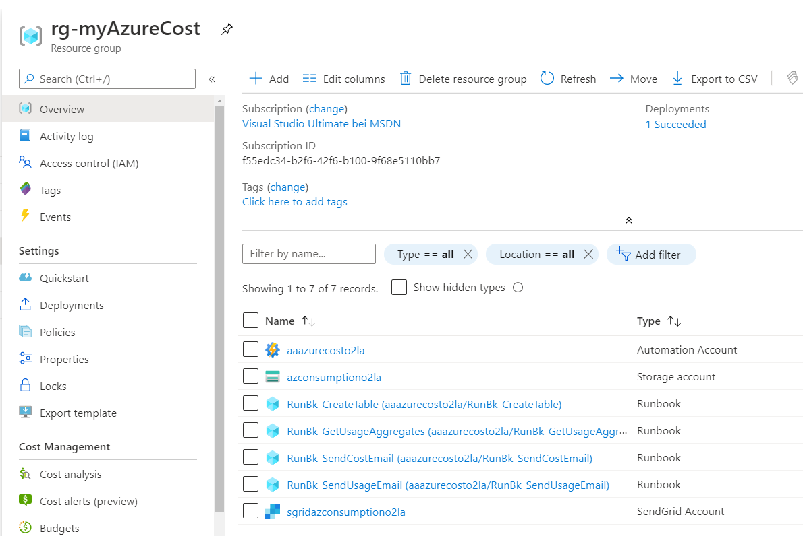

# 1. Deploy the ARM Template

[back](../../README.md)

In this challenge **we will setup the basics requied for myAzureCost.** In order to save time we will **use the Azure Cloud Shell** to run some PowerShell code.  
> **Note**: With the use of Azure Cloud Shell we don't need to install something on your local box. No version conflics. And you are already authenticated at Azure ;-)

## 0. Create an Azure Cloud Shell - if you don't have one. :-)
```
[Azure Portal] -> Click the 'Cloud Shell' symbol close to your login details on the right upper corner.
```  
)  
The **'Cloud Shell' is an in-browser-accessible shell for managing Azure resources**. It already has the required SDKs and tools installed to interact with Azure. You can use either Bash or PowerShell.  
When being asked **choose PowerShell this time**.  
**The first time you use the 'Cloud Shell' you will be asked to setup a storage account** e.g. to store files you have uploaded persistently. [See](https://docs.microsoft.com/en-us/azure/cloud-shell/persisting-shell-storage)  

```
[Azure Portal] -> Click 'Show advanced settings'
```  
  

| Name | Value |
|---|---|
| Subscription  |  _your subscription_ |
| Cloud Shell Region  |  e.g. **West Europe** |   
| Resource Group  |  e.g. **rg-cloudshell** |   
| Storage Account  |  **_some unique value_** |   
| File Share  |  **cloudshell**|   

```
[Azure Portal] -> Create storage
```  
Once successful your shell should appear at the bottom of the page:  


## 1. Let's the 'myAzureCost' Resource Group
Create a Resource Group in a Sendgrid Service supported region.  
```PowerShell
$RGName = "rg-myAzureCost"
$AllowedLocations= @("australiacentral","australiaeast","australiasoutheast","brazilsouth","canadacentral","centralindia","centralus","eastasia","eastus","eastus2","francecentral","japaneast","koreacentral","northcentralus","northeurope","southafricanorth","southcentralus","southeastasia","uksouth","westcentralus","westeurope","westus","westus2")

#select your deployment region
do {
    $regions = @("")
    $AllowedLocations | foreach -Begin { $i = 0 } -Process {
        $i++
        $regions += "{0}. {1}" -f $i, $_
    } -outvariable menu
    $regions | Format-Wide { $_ } -Column 4 -Force
    $r = Read-Host "Select a region to deploy to by number"
    $RGLocation = $regions[$r].Split()[1]
    if ($RGLocation -eq $null) { Write-Host "You must make a valid selection" -ForegroundColor Red }
    else {
        Write-Host "Selecting region $($regions[$r])" -ForegroundColor Green
    }
}
until ($RGLocation -ne $null)

New-AzResourceGroup -Name $RGName -Location $RGLocation

```  

## 2. Create the azure services for myAzureCost. _(30mins)_
The following script deploys the **Azure Automation Account, imports the PowerShell Runbooks, Sets Variables, Storage Account, Sendgrid Service** into the the 'rg-myAzureCost' resource group.  
Please **copy & paste this script into your Cloud Shell**:  


```PowerShell
# These are some parameters for the deployment
$templateParameterObject1 = @{
'myAzureCostSmtpRecipient' =  [string](Read-Host -Prompt 'The email address of the recipient')  # The email recipient
'myAzureCostSmtpSender'= [string](Read-Host -Prompt 'The email address of the sender')
'myAzureCostSmtpSenderPassword'= [string] $(Read-Host -Prompt "The sender's email password" -AsSecureString)
'myAzureCostSmtpServer' = [string] "smtp.office365.com" # The sender s email server
'myAzureCostSmtpServerSSLPort' = [string] "587" # The sender's email server SSL Port
'myAzureCostCultureInfo'=[string] 'de-DE' #en-US, ....
}  

```
Re**run above code until you are happy with the values** ;-) 
> **Important**: Make sure to **use a complex password for the sendgrid email account**! Otherwhise Sendgrid mail setup may fail or be soon out of service.  
Now **kick of the ARM deployment** using aboves parameters - **copy & paste the following code into the cloud shell**:  
  
```PowerShell
$deploymentstart = Get-Date

#Deploy the network
New-AzResourceGroupDeployment -ResourceGroupName "rg-myAzureCost" -Name 'myAzureCost' -Mode Incremental -TemplateUri 'https://raw.githubusercontent.com/bfrankMS/myAzureCost/master/SetupArtefacts/ARM_DailyConsumptionMailer.json' -TemplateParameterObject $templateParameterObject1
  
```  
  
You can **monitor the progress** by:  
```
[Azure Portal] -> Resource Groups -> "rg-AzureCost" -> Deployments -> 'myAzureCost'
```  
Once **finished** (approx **9 minutes**) the result should **look similar to this**:  
|  |   |
|--|--|
| ARM Deployment output in Azure Portal | Look at the **RG after the deployment** |

[next](../CreateAzureRunAsAccount/README.md)