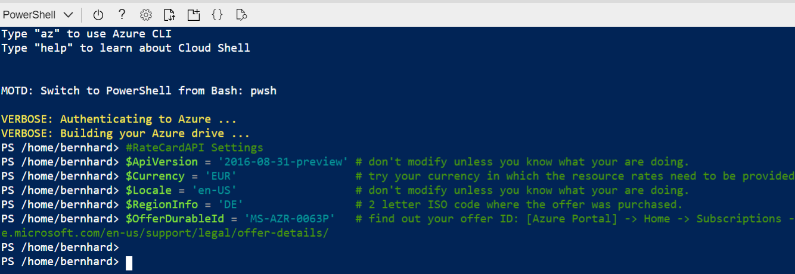
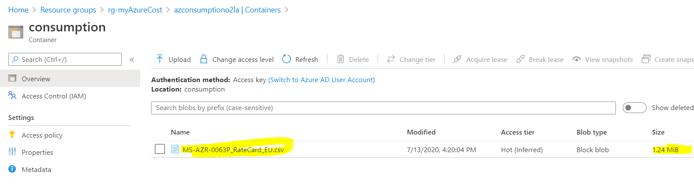
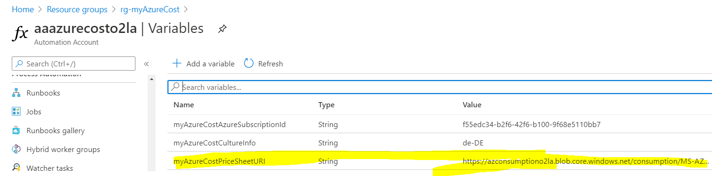

# 4. Generate A Price Sheet

[back](../../README.md)

**myAzureCost** can gather your daily consumption data. Additionally it **can** also **estimate** the **costs** that **your consumption will pose**. To do this **you need to upload a price sheet** with your specific azure rates. The price sheet needs to be **formatted as CSV** (en-us) and contain at least 2 columns: **MeterID** and **MeterRates**.

> **Annotation**: **Every azure resource in each region has a MeterID** (GUID) that uniquely identifies it. When you query the usage of an azure resource the MeterID is delivered with it. **The MeterID translates to a price** -> MeterRates - e.g.:  

| MeterId	| MeterName	| MeterRates |	MeterRegion |
|--|--|--|--|
| 793843d0-d081-4934-9782-ee92505c56cb |D2 v3|0.1011..|	EU West |
  

**Price information for Azure resources is accessible through the** [RateCard API](https://docs.microsoft.com/en-us/azure/cost-management-billing/manage/usage-rate-card-overview#azure-resource-ratecard-api-preview).  
> _**Important**_: "...**EA and CSP not supported**..."
> However: You may upload your own price list containing MeterId, MeterRates columns.  
  
The **following procedure creates a price sheet** as **CSV** ('en-us' formatting) containing the **prices for (in my case) a MSDN subscription** (MS-AZR-0063P) - export prices of the Europe region - **uploads** it **to** the **myAzureCost storage account** - **creates** a **SAS token** (read) **for the Runbook to use it for cost calculation**.


## PowerShell code to gather price sheet.
We need to **define some variables** for the **RateCard REST Call**.  
_**Important:**_ **Copy** the following **code to an editor** and **fill** in **your _OfferDurableId_!**:  

```PowerShell
#RateCardAPI Settings
$ApiVersion = '2016-08-31-preview' # don't modify unless you know what your are doing.
$Currency = 'EUR'                  # try your currency in which the resource rates need to be provided.
$Locale = 'en-US'                  # don't modify unless you know what your are doing.
$RegionInfo = 'DE'                 # 2 letter ISO code where the offer was purchased.
$OfferDurableId = 'MS-AZR-0063P'   # find out your offer ID: [Azure Portal] -> Home -> Subscriptions -> Overview -> Offer ID: .....   -> see https://azure.microsoft.com/en-us/support/legal/offer-details/
```

**Copy the above code / variables into the azure cloud shell**:  
  
  
Now **copy & paste the other following code into the cloud shell**:

```PowerShell
$subscription = Get-AzSubscription
$TenantId = $subscription.Subscription.TenantId

$resAzureGraphAPI = "https://management.azure.com";
$serviceRootURL = "https://management.azure.com/$TenantId"
$authString = "https://login.windows.net/$TenantId";

#get an access token for the REST Call
Import-Module Az.Accounts
$azProfile = [Microsoft.Azure.Commands.Common.Authentication.Abstractions.AzureRmProfileProvider]::Instance.Profile
$currentAzureContext = Get-AzContext
$profileClient = New-Object Microsoft.Azure.Commands.ResourceManager.Common.RMProfileClient($azProfile)
Write-Debug ("Getting access token for tenant" + $currentAzureContext.Tenant.TenantId)
$token = $profileClient.AcquireAccessToken($currentAzureContext.Tenant.TenantId)

#Do RatecardAPI REST Call ->to gather pricing information
$ResourceCard = "https://management.azure.com/subscriptions/{5}/providers/Microsoft.Commerce/RateCard?api-version={0}&`$filter=OfferDurableId eq '{1}' and Currency eq '{2}' and Locale eq '{3}' and RegionInfo eq '{4}'" -f $ApiVersion, $OfferDurableId, $Currency, $Locale, $RegionInfo, $($Subscription.Id)
$authHeader = @{"Authorization" = "BEARER " + $token.AccessToken} 
$r = Invoke-WebRequest -Uri "$ResourceCard" -Method GET -Headers $authHeader 

#create object from json reponse
$Resources = $r.Content | ConvertFrom-Json

#reduce price sheet entries to your favorite region
#smaller price sheet better performance
$Europe = $Resources.Meters.Where({$_.MeterRegion -like "DE *"})      # contains prices for "DE West Central" and "DE North"
$Europe += $Resources.Meters.Where({$_.MeterRegion -like "EU *"})      #"EU North" - "EU West" specific for datacenters in Dublin and Amsterdam
$Europe += $Resources.Meters.Where({$_.MeterRegion -like "Zone*"})    # some networking counters are defined in Zones.
$Europe += $Resources.Meters.Where({$_.MeterRegion -eq ""})           # some values are global and have no 'Region'

#save temp copy of price sheet.
#reformat prices - to filter out a 'base unit price'
$resultPath = "./$OfferDurableId`_RateCard_EU.csv"
$Europe | Select-Object EffectiveDate, IncludedQuantity, MeterCategory, MeterId , MeterName, @{Name = 'MeterRates'; Expression = { $_.MeterRates.0  } },MeterRegion, MeterStatus, MeterSubCategory,Unit |  Export-Csv -Path $resultPath -Encoding UTF8 -Delimiter ';' -NoTypeInformation

#upload content to sa
#to which storage account should the price sheet go?
$RGName = "rg-myAzureCost" 
$aaaccountName = (Get-AzResource -ResourceType Microsoft.Automation/automationAccounts | where Name -Like "aaazurecost*").Name
$storageAccount = Get-AzAutomationVariable -Name "myAzureCostStorageAccountName" -ResourceGroupName $RGName -AutomationAccountName $aaaccountName
$containerName = Get-AzAutomationVariable -Name "myAzureCostSAContainer" -ResourceGroupName $RGName -AutomationAccountName $aaaccountName
$sa = Get-AzStorageAccount -Name $($storageAccount.Value) -ResourceGroupName $RGName
$ctx = $sa.Context
Set-AzStorageBlobContent -Container $($containerName.Value) -Context $ctx -File $resultPath -Blob $(Split-Path $resultPath -Leaf) -Force

#upload successful?
$blob = Get-AzStorageBlob -Container $($containerName.Value) -Context $ctx -Blob (Split-Path $resultPath -Leaf)
"found: $($blob.Name)"

#Set URI in Azure Automation variable
$token = New-AzStorageBlobSASToken -Context $ctx  -CloudBlob $($blob.ICloudBlob) -StartTime ([datetime]::Now).AddHours(-1) -ExpiryTime ([datetime]::Now).AddYears(3) -Permission 'r'
$uri = "https://$($storageAccount.Value).blob.core.windows.net/$($containerName.Value)/$(Split-Path $resultPath -Leaf)$token"
Set-AzAutomationVariable -Name 'myAzureCostPriceSheetURI' -ResourceGroupName $RGName -AutomationAccountName $aaaccountName -Value $uri -Encrypted $false


```

Once **successful** you should **find a price sheet in your storage account**:  
```
[Azure Portal] -> Resource Groups -> "rg-AzureCost" -> 'azconsumption...' (Your Storage Account) -> Containers -> 'consumption'
```  
  

And your **AA variable 'myAzureCostPriceSheetURI' contains a URI to the pricesheet**:  
```
[Azure Portal] -> Resource Groups -> "rg-AzureCost" -> 'aaazurecost...' (Your Automation Account) -> Variables
```  
  

[next](../RunAReport/README.md)