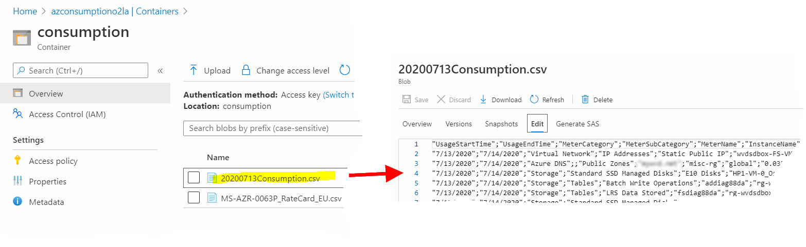
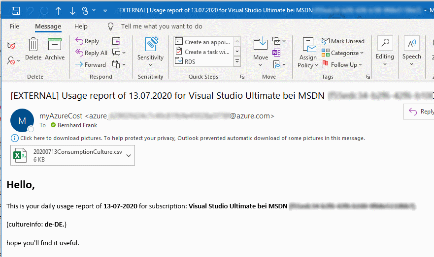
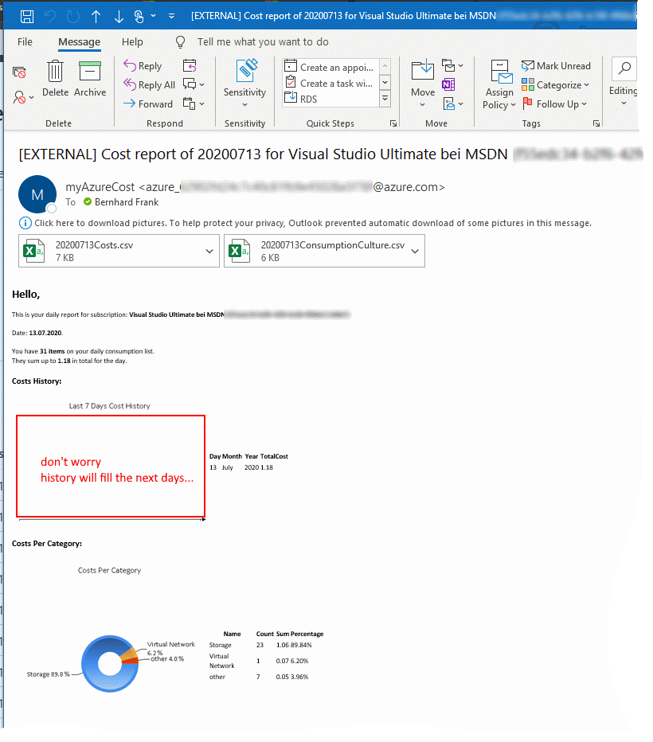
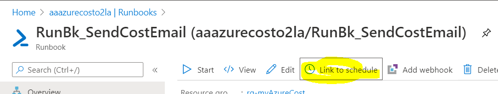

# 5. Run A Report

[back](../../README.md)

Here you'll **kick off the runbooks to test your myAzureCost implementation**. You'll also might **want** to **link** the **runbook** to a **schedule** to receive a **daily report**.  

## Gather your daily usage Runbook
Start the **AA Runbook** that will **gather** the azure **usage for the previous day** it'll **save** it as **CSV** (en-us) in the **storage account** - **Leave the MYDATE parameter empty.**:
```
[Azure Portal] -> Resource Groups -> "rg-AzureCost" -> 'aaazurecost...' (Your Automation Account) -> "Process Automation" Runbooks -> RunBk_GetUsageAggregates -> Start
```  
>**Note**: The **optional** MYDATE parameter takes a short en-us formatted time string MM/dd/yyyy -> e.g. '07/13/2020'

Once the **runbooks is completed** you should find a **result report in your storage account**:  
```
[Azure Portal] -> Resource Groups -> "rg-AzureCost" -> 'azconsumption...' (Your Storage Account) -> Containers -> 'consumption'
```  
  

## Send simple usage report
Kick off the **AA Runbook** that will **send** the just created **report** as **email to the recipient**:  
```
[Azure Portal] -> Resource Groups -> "rg-AzureCost" -> 'aaazurecost...' (Your Automation Account) -> "Process Automation" Runbooks -> RunBk_SendUsageEmail -> Start
```  
Once the **runbooks is completed** you should receive an **email** with just the **report attached as CSV** formatted in the **locale** you have **chosen**: 
  

## Send more complex cost report
Now start the **AA Runbook** that will do a **cost estimation** and **send** it as email the recipient - **Leave the MYDATE parameter empty.**: 
```
[Azure Portal] -> Resource Groups -> "rg-AzureCost" -> 'aaazurecost...' (Your Automation Account) -> "Process Automation" Runbooks -> RunBk_SendCostEmail -> Start
```  
>**Note**: The **optional** MYDATE parameter takes a short en-us formatted time string MM/dd/yyyy -> e.g. '07/13/2020'  

Once the **runbooks is completed** you should receive an **email** with the **costs & graphs** calculated and some reports attached as CSV formatted in the locale you have chosen: 
  


## Link to schedule.
The ARM **deployment for myAzureCost deployed 2 schedules** which **are | can be used to**...:
1. ...**execute** the **RunBk_GetUsageAggregates** runbook **daily** in the morning to **gather the usage info of the previous day**.
2. ...**send** a **daily** usage | cost **report email to the recipient**.

Let's **link the RunBk_SendCostEmail runbook to the _emaildaily_ schedule**:
```
[Azure Portal] -> Resource Groups -> "rg-AzureCost" -> 'aaazurecost...' (Your Automation Account) -> "Process Automation" Runbooks -> RunBk_SendCostEmail -> Link to schedule -> Schedule -> 'daily' -> OK
```  
  
  
**Congratulations you're done!!!**

[back](../../README.md)